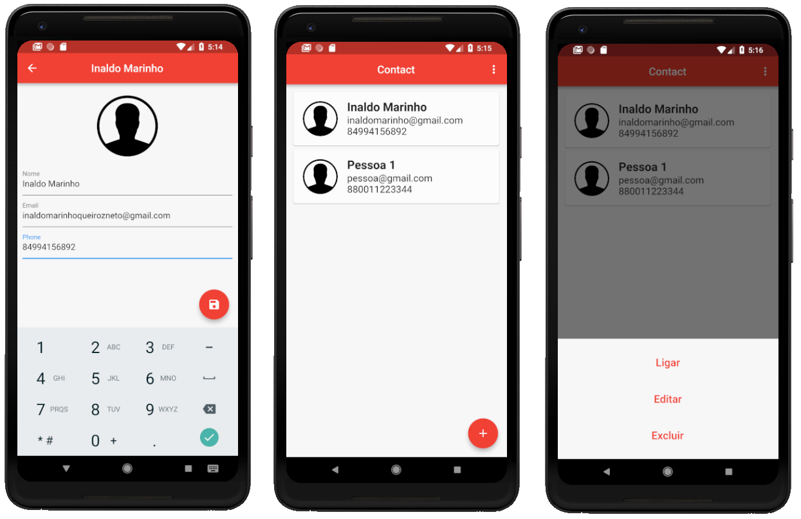
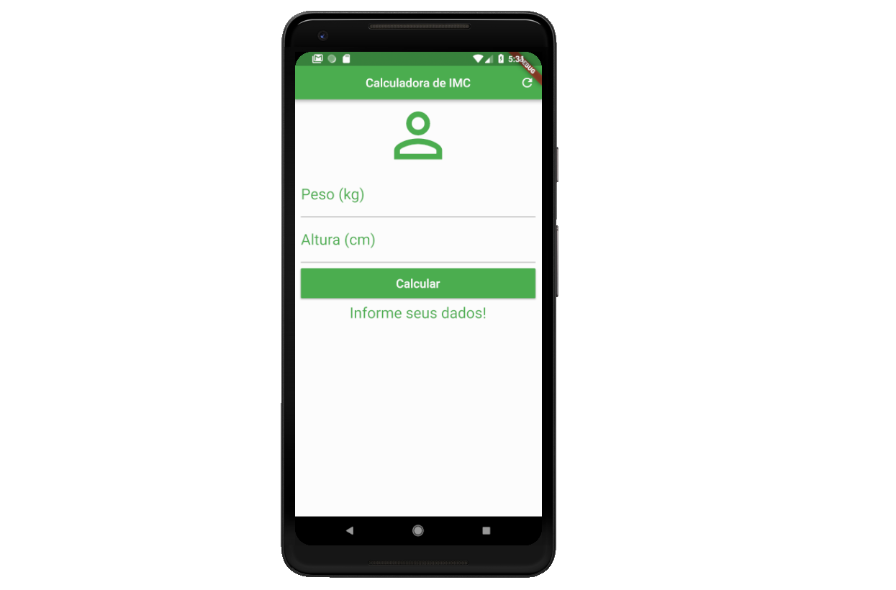
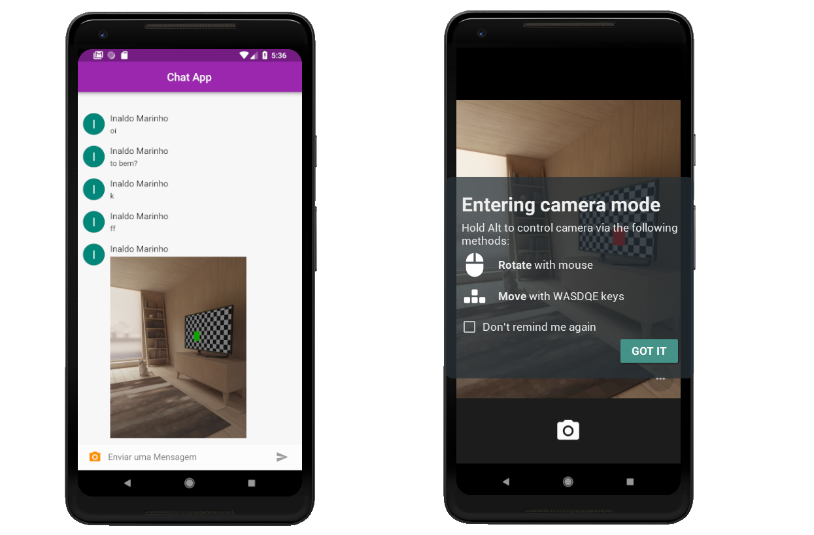
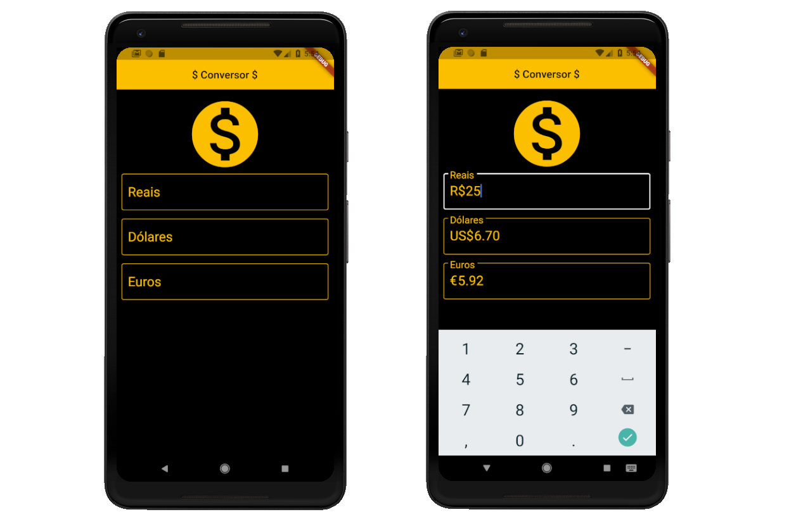
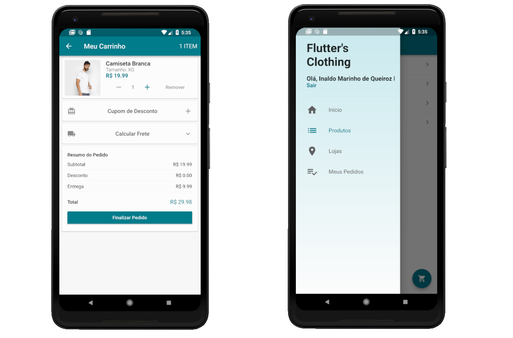
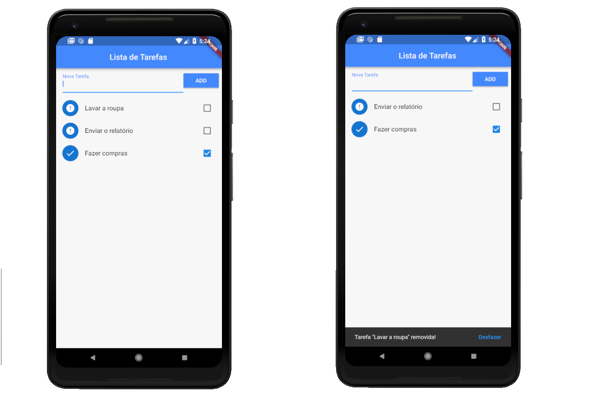

 

# Flutter
Repositório com os projetos utilizando o framework flutter que foi criado pelo Google para o desenvolvimento de aplicativos mobile nativos multiplataforma (IOS e Android).

Saiba mais sobre o flutter nesse artigo no [Medium](https://medium.com/liferay-engineering-brazil/conheça-o-flutter-a-aposta-da-google-para-a-criação-de-apps-nativos-multiplataforma-e59c610134d8).

## Informações sobre os aplicativos

### Agenda de Contatos

O Aplicativo consiste em uma agenda de contato que permite o usuário criar, editar, excluir, ligar(o aplicativo redireciona para realizar a ligação) e ordenar de forma diferente novos contatos. Além de permitir atribuir uma foto a cada usuário que pode ser da câmera ou galeria.

### Buscador de Gifs

O Buscador de Gifs é um aplicativo que faz uso da API do GIPHI para buscar os gifs. O usuário pode buscar gifs, ver os mais populares e compartilhar os mesmo em plataformas como o Whats App.

### Calculadora IMC

Esse aplicativo é bem básico e simples. A partir do peso e altura inseridas pelo usuário ele diz como esta o IMC do mesmo.

### Chat Online

Esse aplicativo é um chat online e o Firebase que é uma plataforma da google que auxilia no desenvolvimento de aplicações mobile e web. Esse aplicativo consiste em um chat de mensagens com várias pessoas, onde todas que possuirem o aplicativo podem visualizar o mesmo, mas para enviar a mensangem precisa esta logado em uma conta do google.

### Contador de Pessoas

O primeiro aplicativo desenvolvido ao longo de curso que tinha como objetivo fazer um simples contador de pessoas em um restaurante. A cada pessoa que entrava o responsável apertaria o botão e o numero de pessoas seria incrementado.

O aplicativo consiste em básicamente apenas um botão, por isso não colocarei uma foto.

### Conversor de Moedas

Tal aplicativo utiliza uma API que fornece os valores da moeda em tempo real e faz a conversão automática. Um exemplo do seu funcionamento é você colocar o valor em reais e ele retorna para você em euro e libras. 

### Loja Virtual

Tal aplicativo utilizar o Firebase e as ferramentas fornecidas por ele. A Loja Virtual é bem completa e complexa e possui todas as funcionalidades de um real aplicativo de loja virtual. Desde o cadastro do cliente, até a adição dos produtos no carrinho com tamanho, quantidades... Além disso o aplicativo mostra o status do pedido, se ele está em preparação, transporte ou entrega.

Esse aplicativo precisa de pouquissimas modificações para ser disponibilizado a alguma loja virtual.

### Organizador de Tarefas

É um aplicativo simples, mas bastante útil. É tanto que ao longo do meu dia a dia eu mesmo o utilizo as vezes. 

Esse aplicativo consiste em um organizador de tarefas e seu funcionamento se dá da seguinte maneira: Você pode adicionar e remover tarefas a sua lista de tarefas e alterar o status das tarefas existentes, dando "ok" nas tarefas feitas. Além disso o aplicativo separa as tarefas feitas das não feitas, facilitando a visualização de tarefas pendentes ao longo do dia.

